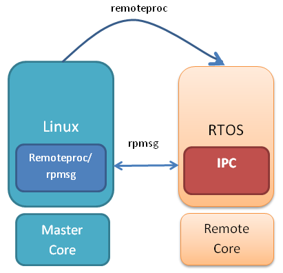
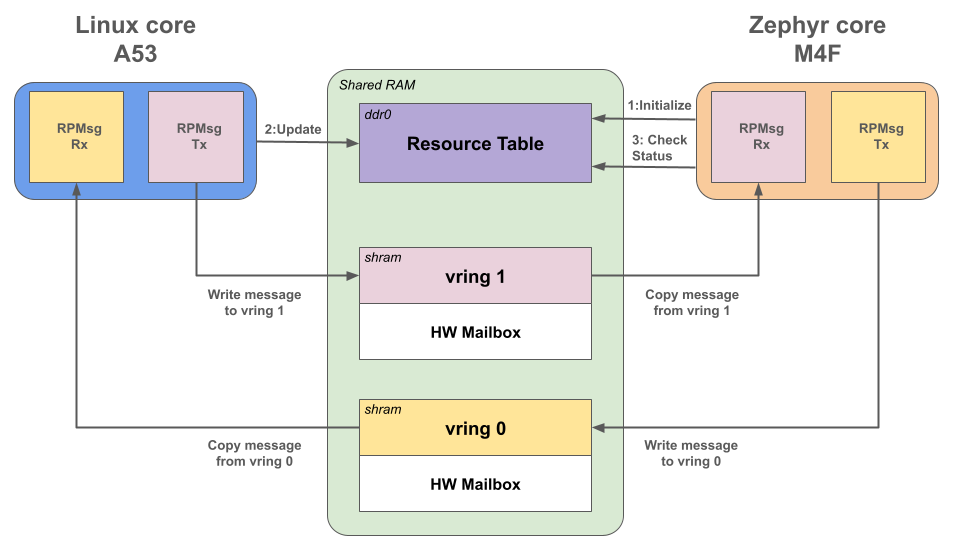
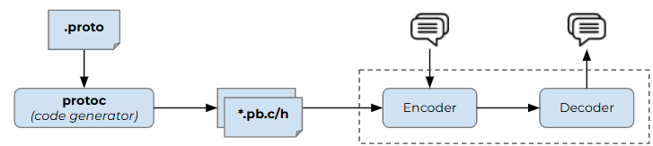
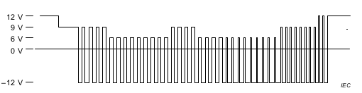

# AC Charger Gen 2 project - Zephyr M4F firmware

This repository hosts the M4F firmware of the **AC Charger Gen 2 project**.

The M4F firmware is designed to run on the phyBOARD-Lyra AM62x board using **Zephyr OS**, specifically on the **Cortex-M4F** core integrated into the TI AM62x SoC.

The firmware manages the PWM signal applied to the circuit of control pilot, drives the Relay Control signal to open/close the relay and communicates with the Linux core by exchanging Rpmsg messages (IPC). 

| Author | Modification | Date     |
| ------ | ------------ | -------- |
| FLEL   | Initial Doc  | 14/02/25 |
|        |              |          |
|        |              |          |

***

## References

[Zephyr Project Documentation - Introduction](https://docs.zephyrproject.org/3.7.0/introduction/index.html)

[Zephyr Project Documentation - Getting Started Guide](https://docs.zephyrproject.org/latest/develop/getting_started/index.html)

[Zephyr Project Documentation - phyBOARD-Lyra AM62x M4F Core](https://docs.zephyrproject.org/latest/boards/phytec/phyboard_lyra/doc/phyboard_lyra_am62xx_m4.html)

[Zephyr Project Documentation -  Lastest Zephyr PDF document](https://docs.zephyrproject.org/latest/zephyr.pdf)

[Zephyr SDK - Version Compatibility Matrix - Google Sheets](https://docs.google.com/spreadsheets/d/1wzGJLRuR6urTgnDFUqKk7pEB8O6vWu6Sxziw_KROxMA/edit?gid=0#gid=0)

[Zephyr Project - GitHub - Primary Git Repository](https://github.com/zephyrproject-rtos/zephyr)

[Zephyr Project - GitHub - Tags SDK](https://github.com/zephyrproject-rtos/sdk-ng/tags)

[OpenAMP Project](https://www.openampproject.org)

***

## Hardware

**Phytec AM62x board V2** reference *PCM-071-5432DE11I.A0 PCB rev: 2*

***

## Software
|    Module    |                                             Repository                                                 |      Branch       |
| ------------ | ------------------------------------------------------------------------------------------------------ | ----------------- |
| M4F firmware | [GitHub tux-evse/ti-am62x-m4-firmware-zephyr](https://github.com/tux-evse/ti-am62x-m4-firmware-zephyr) | main              |
| Zephyr       | [GitHub tux-evse/zephyr](https://github.com/tux-evse/zephyr)                                           | tux-evse-main     |


***

# Installing the Zephyr Environment

From scratch, you have to create the Zephyr environment by installing the different tools (CMake, Python, Devicetree compiler, west, Zephyr SDK) and by cloning the  `tux-evse Zephyr` project located on GitHub [GitHub tux-evse/zephyr](https://github.com/tux-evse/zephyr) branch `tux-evse-main`.

For getting started, please refer to the [Zephyr Getting Started Guide](https://docs.zephyrproject.org/latest/develop/getting_started/index.html) for the Zephyr project and follow the same getting-started guide to set up the environment.

> [!WARNING]
> 
> When running `west init` in the Zephy Getting Started Guide, it's important to instead run `west init -m https://github.com/tux-evse/zephyr --mr tux-evse-main ~/zephyrproject` in order to use the `tux-evse Zephyr` repository.
> 
> ```
> west init -m https://github.com/tux-evse/zephyr --mr tux-evse-main ~/zephyrproject
> ```

***

# Workspace

M4F firmware application is referred to as a **Zephyr workspace application** because it is located inside the west workspace but outside the zephyr repository itself. Its location is  `~/zephyrproject/application_user/ti-am62x-m4-firmware-zephyr`.

The folders and files structure is as shown below:

## Zephyr project structure

```
~/zephyrproject/                 # west topdir
  ├── .west/                     # marks the location of the topdir
  │     └── config               # per-workspace local configuration file
  │
  │   # The manifest repository, never modified by west after creation:
  ├── zephyr/                           # .git/ repo
  │   ├── west.yml                      # manifest file
  │   └── [... other files ...]
  │
  │   # Projects managed by west:
  ├── modules/
  │   └── lib/
  │       └── zcbor/                     # .git/ project
  │
  ├── tools/
  │   └── net-tools/                     # .git/ project
  │
  ├── bootloader/
  │   └── mcuboot/                       # .git/ project
  │
  ├── application_user/
  │   └── ti-am62x-m4-firmware-zephyr/   # .git/ M4F firmware project
  │   └── [... other user apps ...]
  │
  └── [ ... other projects ...]
```

## M4F firmware application structure

```
~/zephyrproject/
  ├── application_user/
  │   └── ti-am62x-m4-firmware-zephyr/ # .git/ M4F firmware project
  │       ├── CMakeLists.txt
  │       ├── prj.conf
  │       ├── README.md
  │       ├── doc/
  │       ├── src/
  │       │   ├── main_remote.c
  │       │   └── pb_codec/
  │       │       └── [ ... Protobuf source files ...]
  │       ├── boards/
  │       │   ├── phyboard_lyra_am6234_m4.conf
  │       │   └── phyboard_lyra_am6234_m4.overlay
  │       ├── dts/
  │       │   └── bindings/
  │       │       ├── gpio-relayctrl.yaml
  │       │       └── pwm-ctrlpilot.yaml
  │       └── build/
  │       │   ├── zephyr/
  │       │   │   ├── am62-mcu-m4f0_0-fw.elf       # M4F firmware binary
  │       │   │   ├── am62-mcu-m4f0_0-fw.map
  │       │   │   └── [ ... other folders & files ...]
  └       └   └── [ ... other folders & files ...]
```

#### `CMakeLists.txt`

This file tells the build system where to find the other application source files, and links the application directory with Zephyr’s CMake build system. 

The list of source files is defined by `target_sources()`.
<br><br>
#### `prj.conf`

This file is a Kconfig fragment that configures the software features needed for the firmware application such as including OpenAMP framework, GPIO driver, etc.

Example to enable the GPIO driver:

```
CONFIG_GPIO=y
```

#### `README.md`

This is the application documentation written in Markdown format.

It describes the purpose of the M4F firmware, building instructions and its usage.
<br><br>
#### `doc` folder

This folder contains the additional project documentation such as images and files included in the README.md file.
<br><br>
#### `src` folder

This folder contains the source files for the firmware application.

`main_remote.c`has the entry point for the firmware application.

**`pb_codec`** subfolder contains the Protobuf sources files.
<br><br>
#### `boards` folder

This folder contains the specific files to the Phytec AM62x board V2:

`phyboard_lyra_am6234_m4.conf` is the board-specific configuration file to enable the Inter-Processor Mailbox (IPM) and mailbox driver.

`phyboard_lyra_am6234_m4.overlay` is the Device Tree Overlay file  for adding or modifying the Device Tree nodes  without changing the main Device Tree.
<br><br>
#### `dts\bindings` folder

This folder contains the custom device tree bindings:

`gpio-relayctrl.yaml` is the custom GPIO-controlled binding for Relay Control.

`pwm-ctrlpilot.yaml` is the custom PWM-based binding for the Control Pilot signal.
<br><br>
#### `build` folder

This folder appears only once firmware application is built and contains the elf file `am62-mcu-m4f0_0-fw.elf`.

The following files are sometimes interesting to take a look at:

- **zephyr/zephyr.dts**: This is the final version of the devicetree in DTS format.

- **zephyr/am62-mcu-m4f0_0-fw.map**: The final map file.

- **zephyr/.config**: The final Kconfig used by the build. This can be useful to check if a setting has been set correctly.

- **zephyr/include/generated/zephyr/devicetree_generated.h**: This generated header file contains the macros and additional comments describing the devicetree.

***

# Building the firmware

The M4F firmware binary is built from the `tux-evse Zephyr` and M4F firmware repositories.
<br><br>
### Clone the M4F firmware repository

The M4F firmware application is located on the repository  [GitHub tux-evse/ti-am62x-m4-firmware-zephyr](https://github.com/tux-evse/ti-am62x-m4-firmware-zephyr)   branch `main` (Default).
 
```
cd $HOME/zephyrproject
  
git clone -b main https://github.com/tux-evse/ti-am62x-m4-firmware-zephyr.git ~/zephyrproject/application_user/ti-am62x-m4-firmware-zephyr
```
<br><br>
### Clone the `tux-evse Zephyr` repository (optional)

There is no need to clone this repository unless it has been updated since the last clone.
  
> [!WARNING]
> **Prerequisites:**
> 
> Zephyr environment must be installed before cloning the `tux-evse Zephyr` repository, please refer to the step "**Installing the Zephyr Environnment**".
  
    
`tux-evse Zephyr` is located on the repository [GitHub tux-evse/zephyr](https://github.com/tux-evse/zephyr) branch `tux-evse-main` (Default).
  
```
cd $HOME/zephyrproject
 
git clone -b tux-evse-main https://github.com/tux-evse/zephyr.git
  
west update
 ```  
<br><br>
### Build the M4F firmware application
  
Build the binary with [west build](https://docs.zephyrproject.org/latest/develop/west/build-flash-debug.html#west-building).

```
cd $HOME/zephyrproject/application_user/ti-am62x-m4-firmware-zephyr
  
west build -p always -b phyboard_lyra/am6234/m4
```

The M4F  firmware binary is located in the **build/zephyr** folder as **am62-mcu-m4f0_0-fw.elf**

***

# Running the firmware

### Copy the M4F firmware binary onto the SD card
  
Insert the SD card in the Ubuntu PC.
  
Transfer the `am62-mcu-m4f0_0-fw.elf`file onto the SD card in the`/rootfs/lib/firmware`directory and rename it as`am62-mcu-m4f0_0-fw`.
  
```
cd $HOME/zephyrproject/application_user/ti-am62x-m4-firmware-zephyr
sudo cp --remove-destination build/zephyr/am62-mcu-m4f0_0-fw.elf /media/$USER/rootfs/lib/firmware/am62-mcu-m4f0_0-fw
```

Eject the SD card from the Ubuntu PC.

Insert the SD card into the Phytec board.
<br><br>
> [!NOTE]
> ***An alternative solution is to copy the firmware binary onto the SD card via ssh:***
> 
> ```
> export BOARD_IP="ww.xx.yy.zz"
> scp ~/zephyrproject/application_user/ti-am62x-m4-firmware-zephyr/build/zephyr/am62-mcu-m4f0_0-fw.elf root@$BOARD_IP:/usr/lib/firmware/am62-mcu-m4f0_0-fw
> ```
>
> *Where ` ww.xx.yy.zz` is the IP address of the Phytec board.*

<br><br>
### Execute the M4F firmware binary
  
Connect the Phytec board to the Ubuntu PC via the picocom cable (USB) to log the Zephyr core traces.
  
```
picocom -b 115200 /dev/ttyUSB1
```
  
Reboot the Phytec board.
  
Picocom displays the execution trace of Zephyr core.
  
*Here is an example of a trace below:*
  
```
*** Booting Zephyr OS build v4.0.0-4697-gb79339beadbe ***
[00:00:00.000,000] <dbg> os: k_sched_unlock: scheduler unlocked (0xb898:0)
[00:00:00.000,000] <inf> ti_am62x_m4_firmware: ========== Zephyr - M4F firmware ti-am62x-m4-firmware V0.4 (24/02/2025) ==========
[00:00:00.000,000] <inf> ti_am62x_m4_firmware: Start led0 init
[00:00:00.000,000] <inf> ti_am62x_m4_firmware: GPIO led is ready
[00:00:00.000,000] <inf> ti_am62x_m4_firmware: GPIO gpio_pin_configure_dt led success
[00:00:00.000,000] <inf> ti_am62x_m4_firmware: led0_init success
[00:00:00.000,000] <inf> ti_am62x_m4_firmware: GPIO relayctl is ready
[00:00:00.000,000] <inf> ti_am62x_m4_firmware: GPIO gpio_pin_configure_dt relayctl success
[00:00:00.000,000] <inf> ti_am62x_m4_firmware: GPIO gpio_pin_set_dt relayctl success
[00:00:00.000,000] <inf> ti_am62x_m4_firmware: relayctl_init success
[00:00:00.000,000] <inf> ti_am62x_m4_firmware: Pilot PWM is ready
[00:00:00.000,000] <inf> ti_am62x_m4_firmware: Pilot PWM Set duty cycle = 5%
[00:00:00.000,000] <dbg> ti_am62x_timer_pwm: pwm_am62x_timer_get_cycles_per_sec: Clock rate successfully get.
[00:00:00.000,000] <dbg> ti_am62x_timer_pwm: pwm_am62x_timer_set_cycles: Period and pulse successfully set.
[00:00:00.000,000] <inf> ti_am62x_m4_firmware: Pilot PWM pwm_set_pulse_dt pilotpwm success
[00:00:00.000,000] <inf> ti_am62x_m4_firmware: pilotpwm_init success
[00:00:00.000,000] <inf> ti_am62x_m4_firmware: Hardware initialization successful
[00:00:00.000,000] <dbg> os: setup_thread_stack: stack 0xc128 for thread 0xb360: obj_size=1024 buf_start=0xc128  buf_size 1024 stack_ptr=0xc528
[00:00:00.000,000] <inf> ti_am62x_m4_firmware: OpenAMP[remote] Linux responder started
[00:00:00.000,000] <inf> ti_am62x_m4_firmware: metal_init: OK
[00:00:00.000,000] <inf> ti_am62x_m4_firmware: IPM device is OK ready
[00:00:00.000,000] <dbg> ti_am62x_m4_firmware: platform_ipm_callback: platform_ipm_callback: msg received from mb 1
[00:00:00.000,000] <inf> ti_am62x_m4_firmware: ipm_set_enabled OK
[00:00:00.000,000] <inf> ti_am62x_m4_firmware: OK to initialize platform
[00:00:00.000,000] <inf> ti_am62x_m4_firmware: Ok to create vdev
[00:00:00.631,000] <inf> ti_am62x_m4_firmware: Ok to init vring 0
[00:00:00.631,000] <inf> ti_am62x_m4_firmware: Ok to init vring 1
[00:00:00.631,000] <dbg> ti_am62x_m4_firmware: platform_ipm_callback: platform_ipm_callback: msg received from mb 1
[00:00:00.631,000] <inf> ti_am62x_m4_firmware: Ok rpmsg_init_vdev
[00:00:00.631,000] <inf> ti_am62x_m4_firmware: OK to create rpmsg virtio device
[00:00:00.631,000] <dbg> os: setup_thread_stack: stack 0xbd28 for thread 0xb2f0: obj_size=1024 buf_start=0xbd28  buf_size 1024 stack_ptr=0xc128
[00:00:00.631,000] <inf> ti_am62x_m4_firmware: OpenAMP[remote] Linux message responder started
[00:00:00.631,000] <dbg> ti_am62x_m4_firmware: mailbox_notify: mailbox_notify: msg received
[00:00:00.631,000] <inf> ti_am62x_m4_firmware: [Linux message client] OK to create endpoint
[00:00:35.736,000] <dbg> ti_am62x_m4_firmware: platform_ipm_callback: platform_ipm_callback: msg received from mb 1
[00:00:35.736,000] <dbg> ti_am62x_m4_firmware: platform_ipm_callback: platform_ipm_callback: msg received from mb 1
[00:00:35.736,000] <inf> ti_am62x_m4_firmware: [Linux message client] ==> Incoming msg (size: 4)
[00:00:35.736,000] <inf> ti_am62x_m4_firmware: MODE PWMState_OFF
[00:00:35.736,000] <inf> ti_am62x_m4_firmware: Pilot PWM Set duty cycle = 100%
[00:00:35.737,000] <dbg> ti_am62x_timer_pwm: pwm_am62x_timer_get_cycles_per_sec: Clock rate successfully get.
[00:00:35.737,000] <dbg> ti_am62x_timer_pwm: pwm_am62x_timer_set_cycles: Period and pulse successfully set.
[00:00:35.737,000] <inf> ti_am62x_m4_firmware: Pilot PWM pwm_set_pulse_dt pilotpwm success
[00:00:35.737,000] <inf> ti_am62x_m4_firmware: [Linux message client] ==> Incoming msg (size: 4)
[00:00:35.737,000] <inf> ti_am62x_m4_firmware: MODE PWMState_OFF
[00:00:35.737,000] <inf> ti_am62x_m4_firmware: Pilot PWM Set duty cycle = 100%
[00:00:35.737,000] <dbg> ti_am62x_timer_pwm: pwm_am62x_timer_get_cycles_per_sec: Clock rate successfully get.
[00:00:35.737,000] <dbg> ti_am62x_timer_pwm: pwm_am62x_timer_set_cycles: Period and pulse successfully set.
[00:00:35.737,000] <inf> ti_am62x_m4_firmware: Pilot PWM pwm_set_pulse_dt pilotpwm success
[00:00:35.737,000] <dbg> ti_am62x_m4_firmware: platform_ipm_callback: platform_ipm_callback: msg received from mb 1
[00:00:35.737,000] <dbg> ti_am62x_m4_firmware: platform_ipm_callback: platform_ipm_callback: msg received from mb 1
[00:00:35.737,000] <inf> ti_am62x_m4_firmware: [Linux message client] ==> Incoming msg (size: 2)
[00:00:35.737,000] <inf> ti_am62x_m4_firmware: Received a enable Tag from CPU
[00:00:35.737,000] <inf> ti_am62x_m4_firmware: [Linux message client] ==> Incoming msg (size: 2)
[00:00:35.737,000] <inf> ti_am62x_m4_firmware: Received a enable Tag from CPU
[00:00:35.770,000] <dbg> ti_am62x_m4_firmware: platform_ipm_callback: platform_ipm_callback: msg received from mb 1
[00:00:35.770,000] <inf> ti_am62x_m4_firmware: [Linux message client] ==> Incoming msg (size: 2)
[00:00:35.770,000] <inf> ti_am62x_m4_firmware: Received a heartbeat from the CPU
[00:00:40.738,000] <dbg> ti_am62x_m4_firmware: platform_ipm_callback: platform_ipm_callback: msg received from mb 1
[00:00:40.738,000] <inf> ti_am62x_m4_firmware: [Linux message client] ==> Incoming msg (size: 2)
[00:00:40.738,000] <inf> ti_am62x_m4_firmware: Received a heartbeat from the CPU
[00:00:45.738,000] <dbg> ti_am62x_m4_firmware: platform_ipm_callback: platform_ipm_callback: msg received from mb 1
[00:00:45.738,000] <inf> ti_am62x_m4_firmware: [Linux message client] ==> Incoming msg (size: 2)
[00:00:45.738,000] <inf> ti_am62x_m4_firmware: Received a heartbeat from the CPU
[00:00:50.738,000] <dbg> ti_am62x_m4_firmware: platform_ipm_callback: platform_ipm_callback: msg received from mb 1
[00:00:50.738,000] <inf> ti_am62x_m4_firmware: [Linux message client] ==> Incoming msg (size: 2)
[00:00:50.738,000] <inf> ti_am62x_m4_firmware: Received a heartbeat from the CPU
[00:00:55.738,000] <dbg> ti_am62x_m4_firmware: platform_ipm_callback: platform_ipm_callback: msg received from mb 1
[00:00:55.738,000] <inf> ti_am62x_m4_firmware: [Linux message client] ==> Incoming msg (size: 2)
[00:00:55.738,000] <inf> ti_am62x_m4_firmware: Received a heartbeat from the CPU
[00:01:00.738,000] <dbg> ti_am62x_m4_firmware: platform_ipm_callback: platform_ipm_callback: msg received from mb 1
[00:01:00.738,000] <inf> ti_am62x_m4_firmware: [Linux message client] ==> Incoming msg (size: 2)
[00:01:00.738,000] <inf> ti_am62x_m4_firmware: Received a heartbeat from the CPU
[00:01:05.738,000] <dbg> ti_am62x_m4_firmware: platform_ipm_callback: platform_ipm_callback: msg received from mb 1
[00:01:05.738,000] <inf> ti_am62x_m4_firmware: [Linux message client] ==> Incoming msg (size: 2)
[00:01:05.738,000] <inf> ti_am62x_m4_firmware: Received a heartbeat from the CPU
[00:01:10.738,000] <dbg> ti_am62x_m4_firmware: platform_ipm_callback: platform_ipm_callback: msg received from mb 1
[00:01:10.738,000] <inf> ti_am62x_m4_firmware: [Linux message client] ==> Incoming msg (size: 2)
[00:01:10.738,000] <inf> ti_am62x_m4_firmware: Received a heartbeat from the CPU
```

***

# Features

The following features are provided:

- InterProcessor Communication (IPC)

- Decoding/encoding the Rpmsg messages using Protocol Buffers (Protobuf)

- Control Pilot PWM

- Relay Control

- Heartbeat Led

### > IPC

Communication between cores is based on RPMsg  framework.

RPMsg allows communication with the Lunix core and the remote core (M4F in our case).

On the remote core side, **OpenAMP** is the solution selected for the RPMsg framework.

The below shows how the Remoteproc/RPMsg driver from the Linux kernel communicates with the IPC driver on a remote core:



Master core is Linux core (Cortex-A53).

Remote core is Zephyr core (Cortex-M4F).
<br><br>
#### OpenAMP

M4F firmware uses the **OpenAMP** framework based on a **resource table** shared between Linux core and Zephyr core.

The following figure shows how the OpenAMP mechanism works:


**Example** Sending a message from the Linux core to the Zephyr core:
1. Linux application sends a message to zephyr core using **RPMsg**,
2. The message is first copied from the Linux application to **vring 1** shared between the two cores. The IPC driver then posts the **vring ID** in the HW mailbox.
3. This action triggers an interrupt on the Zephyr core. In the ISR, the vring ID is extracted, and the vring 1 is checked for new messages.
4. If a message is found, it is extracted from the vring 1 and placed into the Zephyr RPMsg endpoint queue. Zephyr application waiting on this RPMsg endpoint is then unblocked.
5. Zephyr application then handles the received message.

The principle is similar when sending a message from Zephyr core to Linux core, except that in this case, **vring 0** is used.

OpenAMP is enabled by configuring the following settings in the `prj.conf` file of firmware application:
```
# Enable OpenAMP remote
CONFIG_IPM=y
CONFIG_OPENAMP=y
CONFIG_OPENAMP_MASTER=n
```


#### - `Resource Table`
The ressource table (RSC table) is a shared table between Linux cores and the Zephyr core, located in shared memory (address 0x9cc00000 for the TI AM62x, `ddr0` node in DTS).

The resource table is used by the communication mechanism.

The table contains several fields, including:
- **Header**: Indicates the version of the table and the number of entries.
- **Vring parameters**: Shared memory spaces for RPMsg messages.
- **Status fields**: Indicate the state of the coprocessor and its resources.
- **Trace buffer (optional)**: Used to allocate a trace buffer to capture debug messages and execution traces.

**The resource table is defined on the Zephyr side within the M4F firmware image** by configuring the following settings in the `prj.conf` file of firmware application:
```
# Enable the resource table
CONFIG_OPENAMP_RSC_TABLE=y

# Specifies the number of buffer used in a vring for IPC
CONFIG_OPENAMP_RSC_TABLE_NUM_RPMSG_BUFF=8
```

It is interpreted by the Linux core during the M4F firmware startup sequence:
- Linux core loads the M4F firmware image into memory (via RemoteProc), including the **resource table**, and then configures the necessary resources, particularly the **vring0** and **vring1** parameters (addresses, alignment, etc.).
  
  Once the resources are configured, Linux updates the **Status field** in the resource table to **"Resources ready"** (value = 7),
- Linux then starts the Zephyr core,
- Zephyr core begins execution, reads the **Status field**, and checks that it indicates **"Resources ready"**. If not, it waits for the resources to be ready,
- Once this verification is complete, the Zephyr core proceeds with its initialization and can start exchanging messages via **RPMsg**.


#### - `Vring`
**Vrings** are circular shared memory queues used to exchange messages between the **Linux core** and the **Zephyr core** via **RPMsg**.

Two vrings (**vring0** & **vring1**) enable bidirectional communication and are located in shared memory starting from the address @9cb00000 (`shram` node in DTS):   
 - **vring0** is used to send messages from the **Zephyr core** to the **Linux core**.  
 - **vring1** is used to receive messages sent by the **Linux core** to the **Zephyr core**.  
  
Both cores read and write to these vrings using **RPMsg**, with new messages being signaled by a **mailbox interrupt** triggered by writing to the hardware mailbox.


#### - `HW mailbox`
The **hardware mailbox** is a mechanism that triggers an interrupt at the core level when a **32-bit message** (vring ID) is written into its message FIFO (maximum: 4 × 32-bit messages).

##### Configuration of hardware Mailbox (AM62x Mailbox device):

At the physical layer, a hardware mailbox device is used to notify the cores when new messages are waiting in the shared ring buffers (vrings).

TI OMAP Mailbox driver manages the AM62x Mailbox device ( `mbox0` node in DTS).
IPM over MBOX driver is used to let application use the IPM api even if there is not specific IPM driver for the used soc ( `ipc0` node in DTS).
It is enabled by configuring the following settings in the `phyboard_lyra_am6234_m4.conf` file of firmware application:
```
# Enable the Mailbox support and TI OMAP Mailbox driver
CONFIG_MBOX=y
CONFIG_MBOX_TI_OMAP_MAILBOX=y

# Enable IPM over Mailbox
CONFIG_IPM_MBOX=y
```

- An **user identifier** must be assigned to each core to configure the mailbox device:

| Cores   | User ID |
| ------- | ------- |
| **A53** | 0       |
| **M4F** | 2       |
| **R5F** | 1       |


- All cores (Linux, Zephyr, and R5F) exchange 32-bit messages with each other using a dedicated inter-core mailbox:

| Cores *`Rx / Tx`*       |  Linux (A53) *`Rx`* |  Zephyr (M4F) *`Rx`* |   R5F *`Rx`*  |
| ----------------------- | --------------------| -------------------- | ------------- |
| **Linux (A53) *`Tx`***  | -                   | **Mailbox 1**        | Mailbox 3     |
| **Zephyr (M4F) *`Tx`*** | **Mailbox 0**       | -                    | Mailbox 4     |
| **R5F *`Tx`***          | Mailbox 2           | Mailbox 5            | -             |

*For example, Linux core uses the mailbox 1 to send a 32-bit message to the Zephyr core.* 

**Limitation**: M4F firmware configures the Mailbox device to communicate only with the Linux core (No communication is required between Zephy core and R5F core). 

Interrupt enabling is configured on the mailbox device to trigger a receive interrupt when a 32-bit message is received in mailbox 1 (Linux to Zephyr). In our case, receive interrupt is ***IRQ 50*** with priority 4.
<br><br>

### > Protobuf

To exchange data between Linux Cores and Remote Cores, data are serialized using ProtoBuf (Protocol Buffers).

ProtoBuf is an open-source cross-platform data format used to serialize structured data.

Alternative choices : JSON, XML

| Pros | Cons |
| ------- | ------- |
| Strict schema definition | Needs schema definition and compiler (protoc, nanopb in our case) |
| Lightweight : smaller size compared to json of xml formats. | not human readable formats |
| Cross-Language and Cross-Platform |  |

Data structure schemas (called messages) and services are described in a proto definition file (.proto) and compiled with protoc


The Protobuf module comes from the FreeRTOS version of the M4F firmware located to `src/pb_codec` folder of the repository [GitHub tux-evse/ti-am62x-m4-firmware](https://github.com/tux-evse/ti-am62x-m4-firmware).

<br><br>
### > Control Pilot PWM

The Control Pilot PWM is responsible for generating the PWM modulation for the **Control Pilot signal** (IEC 61851-1).

It uses the `ti,am62x-timer-pwm` PWM driver, configured with a frequency of **1 kHz** and a duty cycle set to **5%** by default.



PWM driver is enabled by configuring the following settings in the `phyboard_lyra_am6234_m4.conf` file of firmware application:
```
# Enable PWM
CONFIG_PWM=y
CONFIG_PWM_AM62X_TIMER=y
```

Node `pilot_pwm0` defined in DTS.

Control Pilot PWM is connected to ***MCU_TIMER_IO2*** pin.
<br><br>
### > Relay Control

The Relay Control uses the GPIO driver to open/close the relay.

It is managed by the Rpmsg message "Power_On" received from Linux. 

GPIO driver is enabled by configuring the following setting in the `prj.conf` file of firmware application:
```
# Enable the GPIO driver
CONFIG_GPIO=y
```

Node `relay_ctl0` defined in DTS.

Relay Control is connected to ***MCU_GIO0_14*** pin.
<br><br>
### > Heartbeat Led

The heartbeat led is configured to blink at a rate of **0.5 Hz** once the M4F core starts.

It uses the GPIO driver to turn on or off the led.

Node `heartbeat_led` defined in DTS.

Heartbeat led is connected to ***MCU_GIO0_0*** pin and is located on the SOM (red led).
